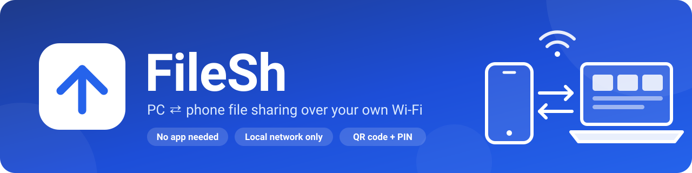

<p align="center">
  
</p>

<p align="center">
  Share files, folders, and text between your Windows PC and your phone over your home Wi‑Fi.<br>
  No app on the phone, no internet, no cloud: the phone just opens a page in its browser.
</p>

<p align="center">
  
  
  
  
</p>

<p align="center">
  
  
  
  
  
</p>

## Start FileSh

**From the `.exe`:** double-click `dist\FileSh.exe` (build it first with `scripts\build.ps1`). FileSh opens in your browser and adds an icon next to the clock.

**From the source code:**

```powershell
.venv\Scripts\Activate.ps1
python -m app.main
```

The first time, Windows asks whether FileSh may use the network: allow it on **Private networks** only.

## Connect your phone

1. Make sure your phone and PC are on the same network, and that Windows calls the network **Private** (Settings → Network & internet → your connection → Network profile type).
2. Scan the **QR code** on the PC page with your phone's camera.
   Or open the address shown on the PC (for example `192.168.1.10:8000`), or `filesh.local:8000`, and type the **PIN**.

## What you can do

- **Files tab:** send files or whole folders from the phone; download files, or whole folders as a ZIP. On the PC you can drag and drop. Photos show thumbnails; tap a photo, video, or song to preview it.
- **Accept / Reject:** when a phone sends files, the PC asks first (you can switch this off in Settings).
- **Text tab:** send text or a link to every connected device, then copy it.
- **History tab** (PC): what was sent and received.
- **Settings tab** (PC): shared folder, auto-stop, HTTPS encryption, `filesh.local`, start with Windows.
- **Stop sharing** disconnects every device at once. Sharing also stops by itself after 30 minutes with no device connected.

Interrupted uploads continue where they stopped. Everything stays on your local network.

## Where things are

- Shared folder: `shared\` in this project, or `C:\Users\<you>\FileSh` when using the `.exe` (change it in Settings).
- FileSh's own settings, history, and log: `%LOCALAPPDATA%\FileSh`.

## For developers

See [AGENTS.md](AGENTS.md) (setup, commands, structure, rules), [docs/features.md](docs/features.md), [docs/design.md](docs/design.md), and [docs/SECURITY.md](docs/SECURITY.md).
